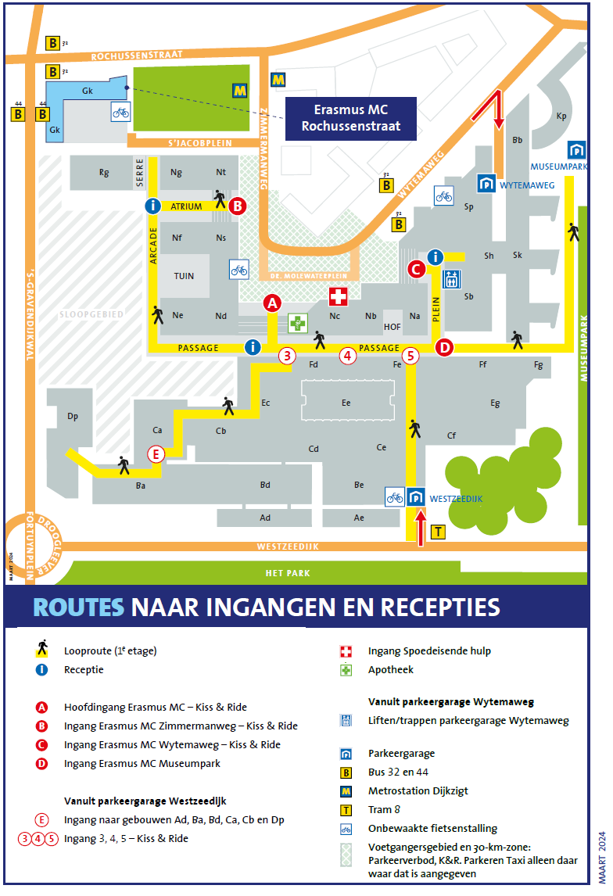

# MGC-BioSB-SingleCellAnalysis2024

This 4-day course will cover the practicalities of single-cell sample prep and analysis with a particular focus on single-cell RNA-seq libraries. This course is aimed at both wet-lab researchers interested in learning how to analyze their own single-cell data sets, as well as bioinformaticians who are new to single-cell sequencing analysis. Basic knowledge of the programming language R is a prerequisite for participation in the course.

The course features a mix of lectures and practicals, and you will have the opportunity to perform hands-on analysis of scRNA-seq data in R. Topics to be covered in the course include (but not limited to): an overview of different single cell platforms, experimental design, preprocessing of scRNA-seq data, normalization, dimensionality reduction, clustering, batch correction, differential expression, trajectory inference, and spatial transcriptomics. The forth day of the course will also include a mini-symposium featuring guest lectures from scientists using various single-cell techniques in their research.

### [Programme](Programme.md)

### Prerequisities
Basic knowledge of R is a prerequisite for participation in the course.

### Software and Data
For this course, we make use of Posit (previously RStudio Cloud). All you need for this is a browser. **Please bring your own laptop**. You will receive more instructions at the beginning of the course.

### Date
29 October – 1 November, 2024

### Location
*This course will take place in-person only*

Location: Erasmus MC, Rotterdam  
Erasmus MC Rochussenstraat (gebouw Gk)   
Room: CQ-1Da

### Lecturers
- Susan Kloet (LUMC)
- Miao Chien (Erasmus MC)
- Ahmed Mahfouz (LUMC/TU Delft)
- Tamim Abdelaal (Genmab)
- Claudio Novella Rausell (LUMC)
- Mikhael Manurung (LUMC)
- Alexander Vieth (LUMC)
- Roberta Menafra (LUMC)
- Anne Alemany (LUMC)

### Teaching Assistants
- Claudio Novella Rausell (LUMC)
- Qirong Mao (LUMC)
- Remco Hoogenboezem (Erasmus MC)
- Mayte Lopez-Cascales (Erasmus MC)

### Contact
Ahmed Mahfouz <A.Mahfouz@lumc.nl>
