Clustering
================

Created by: Ahmed Mahfouz

Edited by: Mohammed Charrout, Lieke Michielsen

# Overview

In this tutorial we will look at different approaches to cluster
scRNA-seq datasets in order to characterize the different subgroups of
cells. Using unsupervised clustering, we will try to identify groups of
cells based on the similarities of the transcriptomes without any prior
knowledge of the labels.

Load required packages:

``` r
suppressMessages(require(Seurat))
```

## Datasets

Again, we will continue with dataset the you have preprocessed and
visualized in the previous practicals. Let’s start by loading the data
again.

During the previous practical, we have already selected highly variable
genes. This step is also to decide which genes to use when clustering
the cells. Single cell RNA-seq can profile a huge number of genes in a
lot of cells. But most of the genes are not expressed enough to provide
a meaningful signal and are often driven by technical noise. Including
them could potentially add some unwanted signal that would blur the
biological variation. Moreover gene filtering can also speed up the
computational time for downstream analysis.

``` r
pbmc <- readRDS('../session-dimensionalityreduction/pbmc3k.rds')
```

## Clustering

### Hierarchical clustering

``` r
# Get scaled counts from the Seurat object
scaled_pbmc <- pbmc[['RNA']]$scale.data

# Calculate Distances (default: Euclidean distance)
distance_euclidean <- dist(t(scaled_pbmc))

#Perform hierarchical clustering using ward linkage
ward_hclust_euclidean <- hclust(distance_euclidean,method = "ward.D2")
plot(ward_hclust_euclidean, main = "dist = eucledian, Ward linkage", labels=FALSE)
```

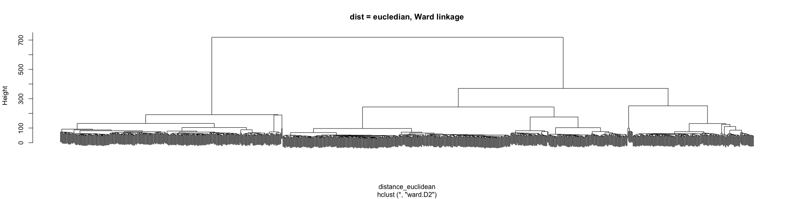<!-- -->

Now cut the dendrogram to generate 10 clusters and plot the cluster
labels and the previously given celltype labels on the t-SNE plot. For
now, we just pick 10, but you can of course vary this number to see how
it influences your results.

``` r
#Cutting the cluster tree to make 10 groups
cluster_hclust <- cutree(ward_hclust_euclidean,k = 10)
pbmc@meta.data$cluster_hclust <- factor(cluster_hclust)

p1 <- DimPlot(pbmc, reduction="tsne", group.by = "cluster_hclust")
p2 <- DimPlot(pbmc, reduction="tsne", group.by = "celltype")

p1+p2
```

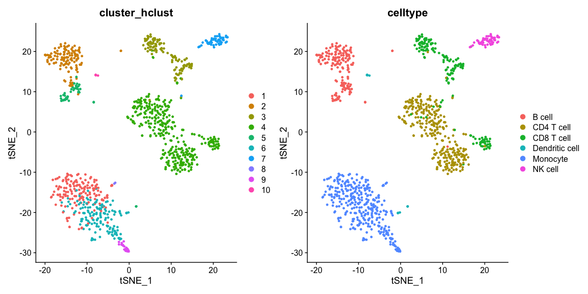<!-- -->

Now let’s try a different distance measure. A commonly used distance
measure is 1 - correlation.

``` r
# Calculate Distances (1 - correlation)
C <- cor(scaled_pbmc)

# Run clustering based on the correlations, where the distance will 
# be 1-correlation, e.g. higher distance with lower correlation.
distance_corr <- as.dist(1-C) 
    
#Perform hierarchical clustering using ward linkage
ward_hclust_corr <- hclust(distance_corr,method="ward.D2")
plot(ward_hclust_corr, main = "dist = 1-corr, Ward linkage", labels=FALSE)
```

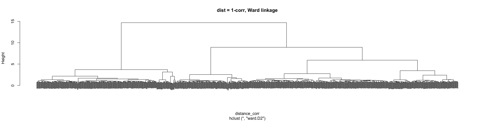<!-- -->

Again, let’s cut the dendrogram to generate 10 clusters and plot the
cluster labels on the t-SNE plot.

``` r
#Cutting the cluster tree to make 10 groups
cluster_hclust <- cutree(ward_hclust_corr,k = 10)
pbmc@meta.data$cluster_hclust <- factor(cluster_hclust)

p1 <- DimPlot(pbmc, reduction="tsne", group.by = "cluster_hclust")
p2 <- DimPlot(pbmc, reduction="tsne", group.by = "celltype")

p1+p2
```

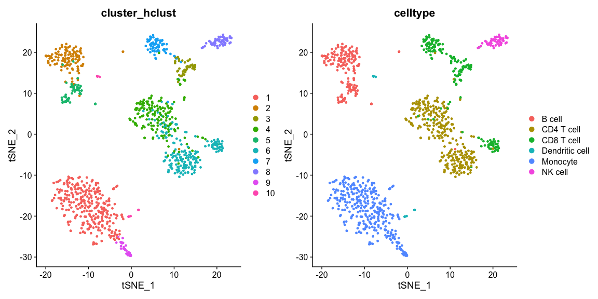<!-- -->

Instead of changing the distance metric, we can change the linkage
method. Instead of using Ward’s method, let’s use complete linkage.

``` r
#Perform hierarchical clustering using complete linkage & euclidean distance
comp_hclust_eucledian <- hclust(distance_euclidean,method = "complete")
plot(comp_hclust_eucledian, main = "dist = euclidean, complete linkage", labels=FALSE)
```

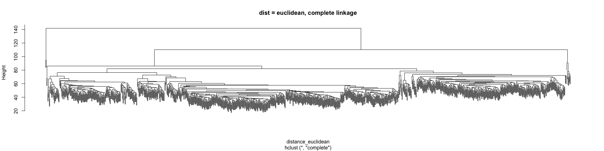<!-- -->

Once more, let’s cut the dendrogram to generate 10 clusters and plot the
cluster labels on the t-SNE plot.

``` r
#Cutting the cluster tree to make 10 groups
cluster_hclust <- cutree(comp_hclust_eucledian,k = 10)
pbmc@meta.data$cluster_hclust <- factor(cluster_hclust)

p1 <- DimPlot(pbmc, reduction="tsne", group.by = "cluster_hclust")
p2 <- DimPlot(pbmc, reduction="tsne", group.by = "celltype")

p1+p2
```

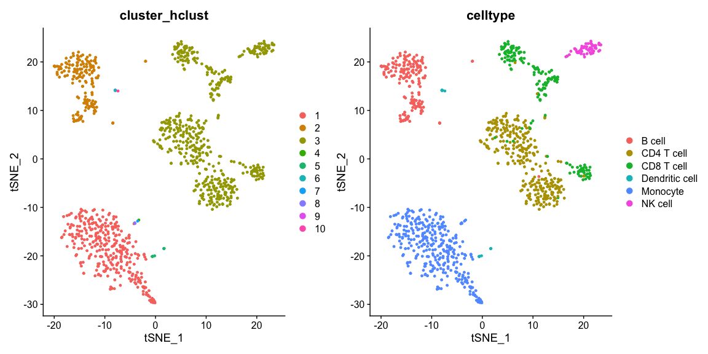<!-- -->
As you can see, these linkage methods and distances cluster the data
differently. If you want, there are even more distance measures and
linkage methods to play around with.

### K-means

Next, we will try the k-means algorithm on the scaled data.

``` r
pbmc_kmeans <- kmeans(x = t(scaled_pbmc), centers = 10)
pbmc@meta.data$cluster_kmeans <- factor(pbmc_kmeans$cluster)

p1 <- DimPlot(pbmc, reduction="tsne", group.by = "cluster_kmeans")
p2 <- DimPlot(pbmc, reduction="tsne", group.by = "celltype")

p1+p2
```

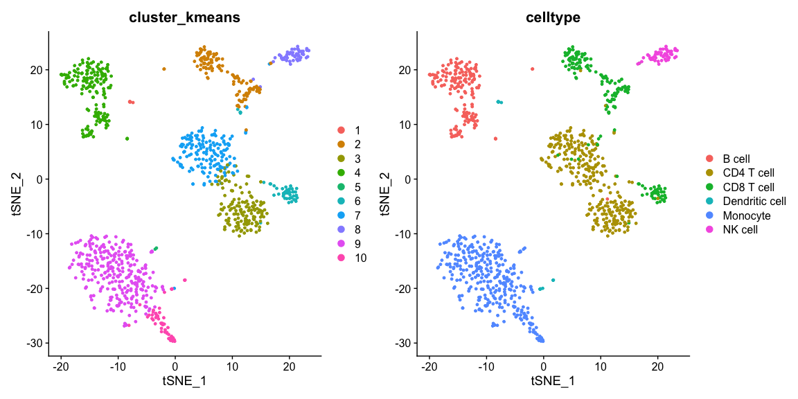<!-- -->

### Graph based clustering

The clustering algorithm of Seurat itself is based on graph based
clustering. The output of the clustering, will be saved automatically in
the metadata as ‘seurat_clusters’. As explained in the lecture, the
resolution parameter is related to the number of clusters. You can play
around with this parameters to see how it influences the results.

``` r
pbmc <- FindNeighbors(pbmc, dims = 1:10, verbose = FALSE)
pbmc <- FindClusters(pbmc, resolution = 0.25, verbose = FALSE)

p1 <- DimPlot(pbmc, reduction="tsne", group.by = "seurat_clusters")
p2 <- DimPlot(pbmc, reduction="tsne", group.by = "celltype")

p1+p2
```

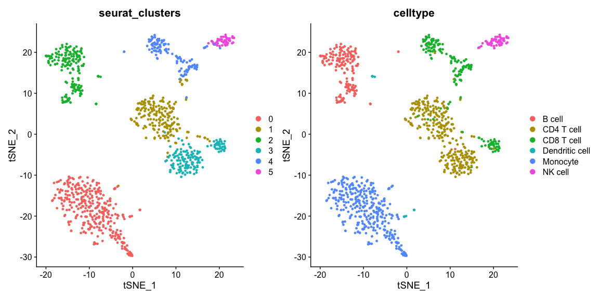<!-- -->

## Visualizing marker genes and annotating the cells

Once, you are satisfied with the clusters, these can be annotated by
visualizing known marker genes or by looking at differentially expressed
genes. In a later practical, you will learn how to select these, for now
we will just focus on known marker genes. A commonly used approach is
that the data is annotated in a hierarchical fashion. First the data is
annotated at a low resolution (e.g. only 2-3 cell types) and afterwards
each cluster is subsetted from the data, clustered and annotated again.
This process can continue until you’re satisfied with the resolution.

``` r
pbmc <- FindNeighbors(pbmc, dims = 1:10, verbose = FALSE)
pbmc <- FindClusters(pbmc, resolution = 0.01, verbose = FALSE)

p1 <- DimPlot(pbmc, reduction="tsne", group.by = "seurat_clusters")
p2 <- DimPlot(pbmc, reduction="tsne", group.by = "celltype")

p1+p2
```

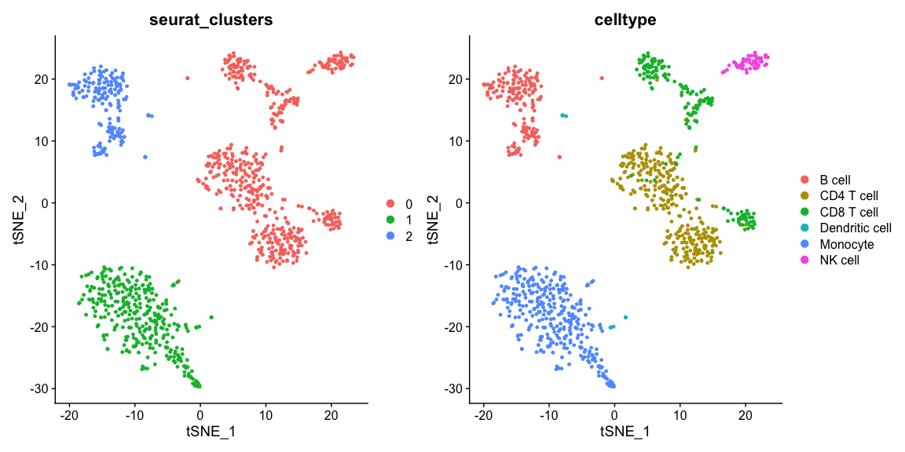<!-- -->

So now that we have clustered the data at a low resolution, we can
visualize some marker genes: CD19 (B cells), CD3D (T cells), CD14
(Monocytes), NKG7 (NK cells).

``` r
FeaturePlot(pbmc, reduction='tsne', features=c('CD19', 'CD3D', 'CD14', 'NKG7'))
```

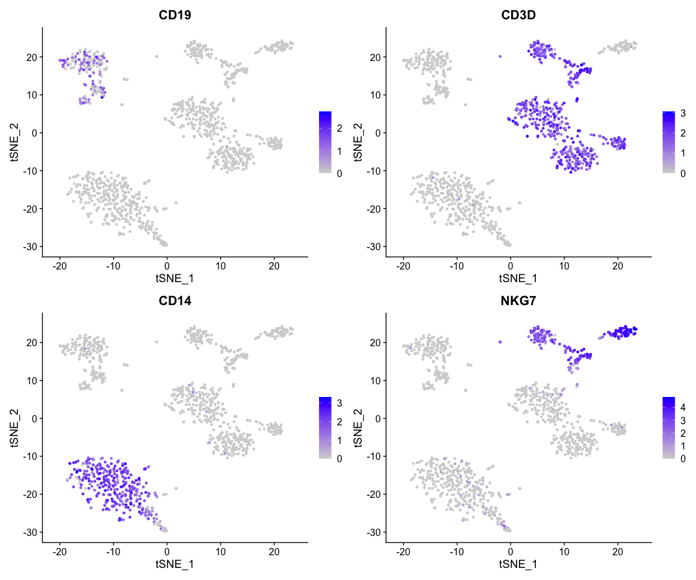<!-- -->

For a new, more complex dataset, you will probably need to visualize
more genes before you can label a cluster. For now, we will assume that
cluster 0 are NK and T cells, cluster 1 are Monocytes and cluster 2 are
B cells. In the code below, you will assign these labels to your
cluster.

``` r
new.cluster.ids <- c("NK and T cells", "Monocytes", "B cells")
names(new.cluster.ids) <- levels(pbmc)
pbmc <- RenameIdents(pbmc, new.cluster.ids)
DimPlot(pbmc, reduction = "tsne", label = TRUE) + NoLegend()
```

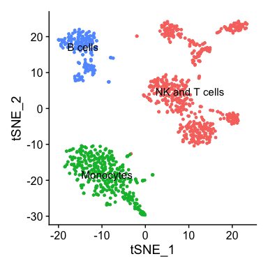<!-- -->

If you want to cluster the cells at a higher resolution, you could for
instance subset the data now and repeat these steps. For now, we will
just save the object for the next practicals.

``` r
saveRDS(pbmc, file = "pbmc3k.rds")
```

### Session info

``` r
sessionInfo()
```

    ## R version 4.4.1 (2024-06-14)
    ## Platform: aarch64-apple-darwin20
    ## Running under: macOS Sonoma 14.5
    ## 
    ## Matrix products: default
    ## BLAS:   /Library/Frameworks/R.framework/Versions/4.4-arm64/Resources/lib/libRblas.0.dylib 
    ## LAPACK: /Library/Frameworks/R.framework/Versions/4.4-arm64/Resources/lib/libRlapack.dylib;  LAPACK version 3.12.0
    ## 
    ## locale:
    ## [1] en_US.UTF-8/en_US.UTF-8/en_US.UTF-8/C/en_US.UTF-8/en_US.UTF-8
    ## 
    ## time zone: Europe/Madrid
    ## tzcode source: internal
    ## 
    ## attached base packages:
    ## [1] stats     graphics  grDevices utils     datasets  methods   base     
    ## 
    ## other attached packages:
    ## [1] Seurat_5.1.0       SeuratObject_5.0.2 sp_2.1-4          
    ## 
    ## loaded via a namespace (and not attached):
    ##   [1] deldir_2.0-4           pbapply_1.7-2          gridExtra_2.3         
    ##   [4] rlang_1.1.4            magrittr_2.0.3         RcppAnnoy_0.0.22      
    ##   [7] spatstat.geom_3.3-2    matrixStats_1.4.1      ggridges_0.5.6        
    ##  [10] compiler_4.4.1         png_0.1-8              vctrs_0.6.5           
    ##  [13] reshape2_1.4.4         stringr_1.5.1          pkgconfig_2.0.3       
    ##  [16] fastmap_1.2.0          labeling_0.4.3         utf8_1.2.4            
    ##  [19] promises_1.3.0         rmarkdown_2.28         purrr_1.0.2           
    ##  [22] xfun_0.47              jsonlite_1.8.8         goftest_1.2-3         
    ##  [25] highr_0.11             later_1.3.2            spatstat.utils_3.1-0  
    ##  [28] irlba_2.3.5.1          parallel_4.4.1         cluster_2.1.6         
    ##  [31] R6_2.5.1               ica_1.0-3              stringi_1.8.4         
    ##  [34] RColorBrewer_1.1-3     spatstat.data_3.1-2    reticulate_1.39.0     
    ##  [37] parallelly_1.38.0      spatstat.univar_3.0-1  lmtest_0.9-40         
    ##  [40] scattermore_1.2        Rcpp_1.0.13            knitr_1.48            
    ##  [43] tensor_1.5             future.apply_1.11.2    zoo_1.8-12            
    ##  [46] sctransform_0.4.1      httpuv_1.6.15          Matrix_1.7-0          
    ##  [49] splines_4.4.1          igraph_2.0.3           tidyselect_1.2.1      
    ##  [52] abind_1.4-8            yaml_2.3.10            spatstat.random_3.3-1 
    ##  [55] codetools_0.2-20       miniUI_0.1.1.1         spatstat.explore_3.3-2
    ##  [58] listenv_0.9.1          lattice_0.22-6         tibble_3.2.1          
    ##  [61] plyr_1.8.9             withr_3.0.1            shiny_1.9.1           
    ##  [64] ROCR_1.0-11            evaluate_0.24.0        Rtsne_0.17            
    ##  [67] future_1.34.0          fastDummies_1.7.4      survival_3.7-0        
    ##  [70] polyclip_1.10-7        fitdistrplus_1.2-1     pillar_1.9.0          
    ##  [73] KernSmooth_2.23-24     plotly_4.10.4          generics_0.1.3        
    ##  [76] RcppHNSW_0.6.0         ggplot2_3.5.1          munsell_0.5.1         
    ##  [79] scales_1.3.0           globals_0.16.3         xtable_1.8-4          
    ##  [82] glue_1.7.0             lazyeval_0.2.2         tools_4.4.1           
    ##  [85] data.table_1.16.0      RSpectra_0.16-2        RANN_2.6.2            
    ##  [88] leiden_0.4.3.1         dotCall64_1.1-1        cowplot_1.1.3         
    ##  [91] grid_4.4.1             tidyr_1.3.1            colorspace_2.1-1      
    ##  [94] nlme_3.1-166           patchwork_1.2.0        cli_3.6.3             
    ##  [97] spatstat.sparse_3.1-0  spam_2.10-0            fansi_1.0.6           
    ## [100] viridisLite_0.4.2      dplyr_1.1.4            uwot_0.2.2            
    ## [103] gtable_0.3.5           digest_0.6.37          progressr_0.14.0      
    ## [106] ggrepel_0.9.6          farver_2.1.2           htmlwidgets_1.6.4     
    ## [109] htmltools_0.5.8.1      lifecycle_1.0.4        httr_1.4.7            
    ## [112] mime_0.12              MASS_7.3-61
