Dimensionality Reduction
================
Thomas Hollt, Mohammed Charrout, Lieke Michielsen

# Dimensionality Reduction & Visualization

In this tutorial we will look at different ways to visualize single
celhttps://0a5681ff63cf4da19c61ae6d3d88b674.app.rstudio.cloud/graphics/ce6dfe91-200f-4e6d-a39b-e7db96824545.pngl
RNA-seq datasets using dimensionality reduction. We will apply the
Principal Component Analysis (PCA), t-distributed Stochastic Neighbor
Embedding (t-SNE) and Uniform Manifold Approximation and Projection
(UMAP) algorithms. Further, we will look at different ways to plot the
dimensionality reduced data and augment them with additional
information, such as gene expression or meta-information.

## Datasets

For this tutorial we will continue with the dataset you have
preprocessed in the previous practicals. We will also give you some cell
type labels for visualization purposes. During a later practical, you
will learn how to annotate the cells yourself.

### Data preprocessing

Load required packages. Here, we will use the Seurat functions for the
dimensionality reduction. They are also available as pure R functions
but Seurat nicely packages them for our data. We will use ggplot for
creating the plots.

``` r
library(Seurat)
library(ggplot2)
```

### Data loading and preprocessing

First, we load the Seurat object from the previous practical and attach
the celltype labels.

``` r
pbmc = readRDS('../session-qc-normalization/pbmc3k.rds')
labels = read.delim('celltype_labels.tsv', row.names = 1)
pbmc <- AddMetaData(
    object = pbmc,
    metadata = labels)
```

Since the data is already normalized in the previous practical, we can
skip these steps here. We will only need to scale the data.

``` r
# Run the standard workflow for visualization and clustering
pbmc <- ScaleData(pbmc, verbose = FALSE)
```

## Dimensionality Reduction

From here on, we will have a look at the different dimensionality
reduction methods and their parameterizations.

### PCA

We start with PCA. Seurat provides the `RunPCA` function, we use `pbmc`
as input data. `npcs` refers to the number of principal components to
compute. We set it to `100.` This will take a bit longer to compute but
will allow use to explore the differences using different numbers of PCs
below. By assigning the result to our `pbmc` data object it will be
available in the object with the default name `pca`.

``` r
pbmc <- RunPCA(pbmc, npcs = 100, verbose = FALSE)
```

We can now plot the first two components using the `DimPlot` function.
The first argument here is the Seurat data object `pbmc`. By providing
the `Rreduction = "pca"` argument, `DimPlot` looks in the object for the
PCA we created and assigned above.

``` r
DimPlot(pbmc, reduction = "pca")
```

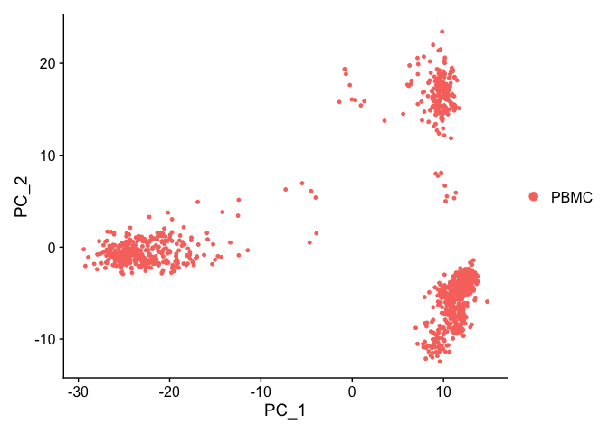<!-- -->

This plot shows some structure of the data. Every dot is a cell, but we
do not know which cells belong to which dot, etc. We can add meta
information by the `group.by` parameter. We use the `celltype` that we
have read from the metadata object.

``` r
DimPlot(pbmc, reduction = "pca", group.by = "celltype")
```

<!-- -->

We can see that only a few of the labeled cell-types separate well but
many are clumped together on the bottom of the plot.

Let’s have a look at the PCs to understand a bit better how PCA
separates the data. Using the `DimHeatmap` function, we can plot the
expression of the top genes for each PC for a number of cells. We will
plot the first six components `dims = 1:6` for 500 random cells
`cells = 500`. Each component will produce one heatmap, the cells will
be the columns in the heatmap and the top genes for each component the
rows.

``` r
DimHeatmap(pbmc, dims = 1:6, cells = 500, balanced = TRUE)
```

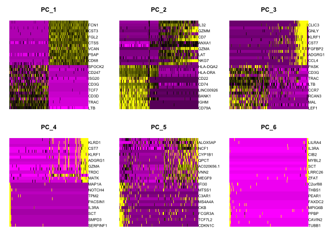<!-- -->

As discussed in the lecture, and indicated above, PCA is not optimal for
visualization, but can be very helpful in reducing the complexity before
applying non-linear dimensionality reduction methods. For that, let’s
have a look how many PCs actually cover the main variation. A very
simple, fast-to-compute way is simply looking at the standard deviation
per PC. We use the `ElbowPlot`.

``` r
ElbowPlot(pbmc, ndims = 100)
```

<!-- -->

As we can see there is a very steep drop in standard deviation within
the first 20 or so PCs indicating that we will likely be able to use
roughly that number of PCs as input to following computations with
little impact on the results.

### t-SNE

Let’s try out t-SNE. Seurat by default uses the [Barnes Hut (BH) SNE
implementation](https://arxiv.org/abs/1301.3342).

Similar to the PCA, Seurat provides a convenient function to run t-SNE
called `RunTSNE`. We provide the `pbmc` data object as parameter. By
default `RunTSNE` will look for and use the PCA we created above as
input, we can also force it with `reduction = "pca"`. Again we use
`DimPlot` to plot the result, this time using `reduction = "tsne"` to
indicate that we want to plot the t-SNE computation. We create two
plots, the first without and the second with the cell-types used for
grouping. Already without the coloring, we can see much more structure
in the plot than in the PCA plot. With the color overlay we see that
most cell-types are nicely separated in the plot.

``` r
pbmc <- RunTSNE(pbmc, reduction = "pca")
p1 <- DimPlot(pbmc, reduction = "tsne") + NoLegend()
p2 <- DimPlot(pbmc, reduction = "tsne", group.by = "celltype")
p1 + p2
```

<!-- -->

Above we did not specify the number of PCs to use as input. Let’s have a
look what happens with different numbers of PCs as input. We simply run
`RunTSNE` multiple times with `dims` defining a range of PCs. *Note*
every run overwrites the `tsne` object nested in the `pbmc` object.
Therefore we plot the tsne directly after each run and store all plots
in a object. We add `+ NoLegend() + ggtitle("n PCs")` to remove the list
of cell types for compactness and add a title.

``` r
# PC_1 to PC_5
pbmc <- RunTSNE(pbmc, reduction = "pca", dims = 1:5)
p1 <- DimPlot(pbmc, reduction = "tsne", group.by = "celltype") + NoLegend() + ggtitle("5 PCs")
# PC_1 to PC_10
pbmc <- RunTSNE(pbmc, reduction = "pca", dims = 1:10)
p2 <- DimPlot(pbmc, reduction = "tsne", group.by = "celltype") + NoLegend() + ggtitle("10 PCs")
# PC_1 to PC_30
pbmc <- RunTSNE(pbmc, reduction = "pca", dims = 1:30)
p3 <- DimPlot(pbmc, reduction = "tsne", group.by = "celltype") + NoLegend() + ggtitle("30 PCs")
# PC_1 to PC_100
pbmc <- RunTSNE(pbmc, reduction = "pca", dims = 1:100)
p4 <- DimPlot(pbmc, reduction = "tsne", group.by = "celltype") + NoLegend() + ggtitle("100 PCs")
p1 + p2 + p3 + p4
```

<!-- -->

Looking at these plots, it seems `RunTSNE` by default only uses 5 PCs
(the plot is identical to the plot with default parameters above), but
we get much clearer separation of clusters using 10 or even 30 PCs. This
is not surprising considering the plot above of the standard deviation
within the PCs above. Therefore we will use 30 PCs in the following, by
explicitly setting `dims = 1:30`. *Note* that t-SNE is slower with more
input dimensions (here the PCs), so it is good to find a middleground
between capturing as much variation as possible with as few PCs as
possible. However, using the default 5 does clearly not produce optimal
results for this dataset. When using t-SNE with PCA preprocessing with
your own data, always check how many PCs you need to cover the variance,
as done above.

t-SNE has a few hyper-parameters that can be tuned for better
visualization. There is an [excellent
tutorial](https://distill.pub/2016/misread-tsne/). The main parameter is
the perplexity, basically indicating how many neighbors to look at. We
will run different perplexities to see the effect. As we will see, a
perplexity of 30 is the default. This value often works well, again it
might be advisable to test different values with other data. *Note*,
higher perplexity values make t-SNE slower to compute.

``` r
# Perplexity 3
pbmc <- RunTSNE(pbmc, reduction = "pca", dims = 1:30, perplexity = 3)
p1 <- DimPlot(pbmc, reduction = "tsne", group.by = "celltype") + NoLegend() + ggtitle("30PCs, Perplexity 3")
# Perplexity 10
pbmc <- RunTSNE(pbmc, reduction = "pca", dims = 1:30, perplexity = 10)
p2 <- DimPlot(pbmc, reduction = "tsne", group.by = "celltype") + NoLegend() + ggtitle("30PCs, Perplexity 10")
# Perplexity 30
pbmc <- RunTSNE(pbmc, reduction = "pca", dims = 1:30, perplexity = 30)
p3 <- DimPlot(pbmc, reduction = "tsne", group.by = "celltype") + NoLegend() + ggtitle("30PCs, Perplexity 30")
# Perplexity 200
pbmc <- RunTSNE(pbmc, reduction = "pca", dims = 1:30, perplexity = 200)
p4 <- DimPlot(pbmc, reduction = "tsne", group.by = "celltype") + NoLegend() + ggtitle("30PCs, Perplexity 200")
p1 + p2 + p3 + p4
```

<!-- -->

Another important parameter is the number of iterations. t-SNE gradually
optimizes the low-dimensional space. The more iterations the more there
is to optimize. We will run different numbers of iterations to see the
effect. As we will see, 1000 iterations is the default. This value often
works well, again it might be advisable to test different values with
other data. Especially for larger datasets you will need more
iterations. *Note*, more iterations make t-SNE slower to compute.

``` r
# 100 iterations
pbmc <- RunTSNE(pbmc, reduction = "pca", dims = 1:30, max_iter = 100)
p1 <- DimPlot(pbmc, reduction = "tsne", group.by = "celltype") + NoLegend() + ggtitle("100 iterations")
# 500 iterations
pbmc <- RunTSNE(pbmc, reduction = "pca", dims = 1:30, max_iter = 500)
p2 <- DimPlot(pbmc, reduction = "tsne", group.by = "celltype") + NoLegend() + ggtitle("500 iterations")
# 1000 iterations
pbmc <- RunTSNE(pbmc, reduction = "pca", dims = 1:30, max_iter = 1000)
p3 <- DimPlot(pbmc, reduction = "tsne", group.by = "celltype") + NoLegend() + ggtitle("1000 iterations")
# 2000 iterations
pbmc <- RunTSNE(pbmc, reduction = "pca", dims = 1:30, max_iter = 2000)
p4 <- DimPlot(pbmc, reduction = "tsne", group.by = "celltype") + NoLegend() + ggtitle("2000 iterations")
p1 + p2 + p3 + p4
```

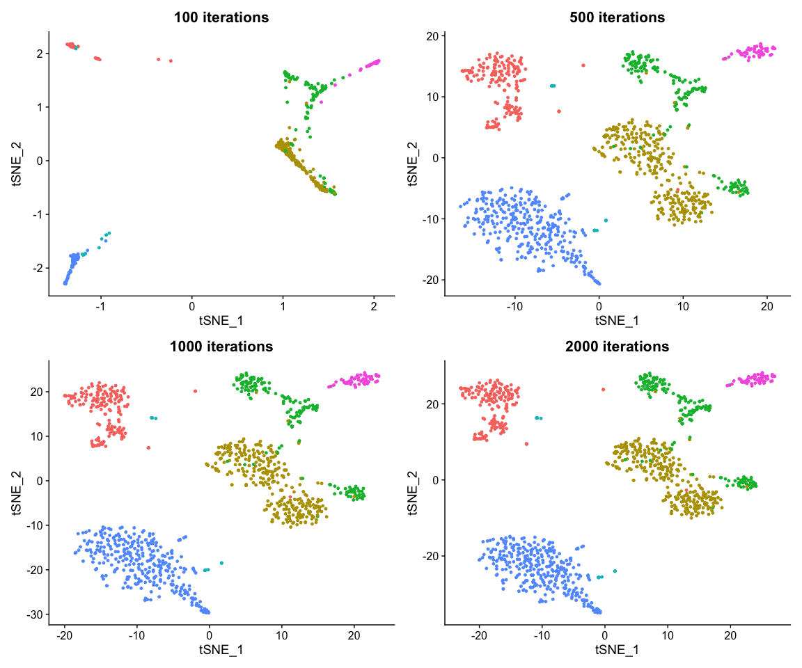<!-- -->

As we see after 100 iterations the main structure becomes apparent, but
there is very little detail. 500 to 2000 iterations all look very
similar, with 500 still a bit more loose than 1000, indicating that the
optimization converges somewhere between 500 and 1000 iterations. In
this case running 2000 would definitely not necessary.

### UMAP

We have seen t-SNE and it’s main parameters. Let’s have a look at UMAP.
Its main function call is very similar to t-SNE and PCA and called
`RunUMAP`. Again, by default it looks for the PCA in the `pbmc` data
object, but we have to provide it with the number of PCs (or `dims`) to
use. Here, we use `30`. As expected, the plot looks rather similar to
the t-SNE plot, with more compact clusters.

``` r
pbmc <- RunUMAP(pbmc, dims = 1:30, verbose = FALSE)
```

    ## Warning: The default method for RunUMAP has changed from calling Python UMAP via reticulate to the R-native UWOT using the cosine metric
    ## To use Python UMAP via reticulate, set umap.method to 'umap-learn' and metric to 'correlation'
    ## This message will be shown once per session

``` r
DimPlot(pbmc, reduction = "umap", group.by = "celltype")
```

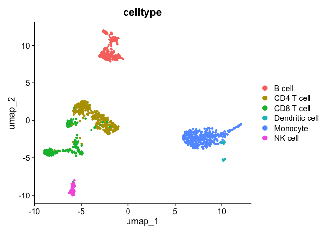<!-- -->

Just like t-SNE, UMAP has a bunch of parameters. In fact, Seurat exposes
quite a few more than for t-SNE. We will look at the most important in
the following. An interactive tutorial can be found
[here](https://pair-code.github.io/understanding-umap/), and a
[comparison with the same
datasets](https://jlmelville.github.io/uwot/umap-simple.html) between
UMAP and t-SNE.

Again, we start with a different number of PCs. Similar to t-SNE, 5 is
clearly not enough, 30 provides decent separation and detail. Just like
for t-SNE, test this parameter to match your own data in real-world
experiments.

``` r
# PC_1 to PC_5
pbmc <- RunUMAP(pbmc, dims = 1:5, verbose = FALSE)
p1 <- DimPlot(pbmc, reduction = "umap", group.by = "celltype") + NoLegend() + ggtitle("5 PCs")
# PC_1 to PC_10
pbmc <- RunUMAP(pbmc, dims = 1:10, verbose = FALSE)
p2 <- DimPlot(pbmc, reduction = "umap", group.by = "celltype") + NoLegend() + ggtitle("10 PCs")
# PC_1 to PC_30
pbmc <- RunUMAP(pbmc, dims = 1:30, verbose = FALSE)
p3 <- DimPlot(pbmc, reduction = "umap", group.by = "celltype") + NoLegend() + ggtitle("30 PCs")
# PC_1 to PC_100
pbmc <- RunUMAP(pbmc, dims = 1:100, verbose = FALSE)
p4 <- DimPlot(pbmc, reduction = "umap", group.by = "celltype") + NoLegend() + ggtitle("100 PCs")
p1 + p2 + p3 + p4
```

<!-- -->

The `n.neighbors` parameter sets the number of neighbors to consider for
UMAP. This parameter is similar to the perplexity in t-SNE. We try a
similar range of values for comparison. The results are quite similar to
t-SNE. With low values, clearly the structures are too spread out, but
quickly the embeddings become quite stable. The default vaule for
RunUMAP is 30. Similar to t-SNE this value is quite general. Again, it’s
always a good idea to run some test with new data to find a good value.

``` r
# 3 Neighbors
pbmc <- RunUMAP(pbmc, dims = 1:30, n.neighbors = 3, verbose = FALSE)
p1 <- DimPlot(pbmc, reduction = "umap", group.by = "celltype") + NoLegend() + ggtitle("3 Neighbors")
# 10 Neighbors
pbmc <- RunUMAP(pbmc, dims = 1:30, n.neighbors = 10, verbose = FALSE)
p2 <- DimPlot(pbmc, reduction = "umap", group.by = "celltype") + NoLegend() + ggtitle("10 Neighbors")
# 30 Neighbors
pbmc <- RunUMAP(pbmc, dims = 1:30, n.neighbors = 30, verbose = FALSE)
p3 <- DimPlot(pbmc, reduction = "umap", group.by = "celltype") + NoLegend() + ggtitle("30 Neighbors")
# 200 Neighbors
pbmc <- RunUMAP(pbmc, dims = 1:30, n.neighbors = 200, verbose = FALSE)
p4 <- DimPlot(pbmc, reduction = "umap", group.by = "celltype") + NoLegend() + ggtitle("200 Neighbors")
p1 + p2 + p3 + p4
```

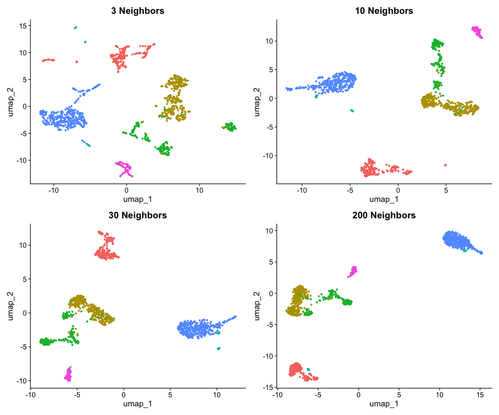<!-- -->

Another parameter is `min.dist`. There is no directly comparable
parameter in t-SNE. Generally, `min.dist` defines the compactness of the
final embedding. The default value is 0.3.

``` r
# Min Distance 0.01
pbmc <- RunUMAP(pbmc, dims = 1:30, min.dist = 0.01, verbose = FALSE)
p1 <- DimPlot(pbmc, reduction = "umap", group.by = "celltype") + NoLegend() + ggtitle("Min Dist 0.01")
# Min Distance 0.1
pbmc <- RunUMAP(pbmc, dims = 1:30, min.dist = 0.1, verbose = FALSE)
p2 <- DimPlot(pbmc, reduction = "umap", group.by = "celltype") + NoLegend() + ggtitle("Min Dist 0.1")
# Min Distance 0.3
pbmc <- RunUMAP(pbmc, dims = 1:30, min.dist = 0.3, verbose = FALSE)
p3 <- DimPlot(pbmc, reduction = "umap", group.by = "celltype") + NoLegend() + ggtitle("Min Dist 0.3")
# Min Distance 1.0
pbmc <- RunUMAP(pbmc, dims = 1:30, min.dist = 1.0, verbose = FALSE)
p4 <- DimPlot(pbmc, reduction = "umap", group.by = "celltype") + NoLegend() + ggtitle("Min Dist 1.0")
p1 + p2 + p3 + p4
```

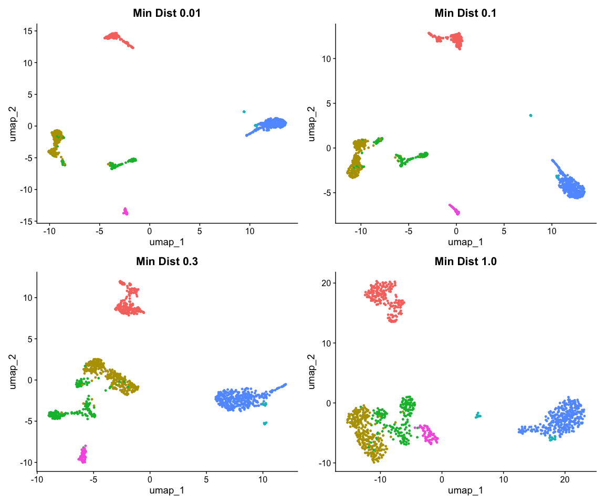<!-- -->

`n.epochs` is comparable to the number of iterations in t-SNE.
Typically, UMAP needs fewer of these to converge, but also changes more
when it is run longer. The default is 500. Again, this should be
adjusted to your data.

``` r
# 10 epochs
pbmc <- RunUMAP(pbmc, dims = 1:30, n.epochs = 10, verbose = FALSE)
p1 <- DimPlot(pbmc, reduction = "umap", group.by = "celltype") + NoLegend() + ggtitle("10 Epochs")
# 100 epochs
pbmc <- RunUMAP(pbmc, dims = 1:30, n.epochs = 100, verbose = FALSE)
p2 <- DimPlot(pbmc, reduction = "umap", group.by = "celltype") + NoLegend() + ggtitle("100 Epochs")
# 500 epochs
pbmc <- RunUMAP(pbmc, dims = 1:30, n.epochs = 500, verbose = FALSE)
p3 <- DimPlot(pbmc, reduction = "umap", group.by = "celltype") + NoLegend() + ggtitle("500 Epochs")
# 1000 epochs
pbmc <- RunUMAP(pbmc, dims = 1:30, n.epochs = 1000, verbose = FALSE)
p4 <- DimPlot(pbmc, reduction = "umap", group.by = "celltype") + NoLegend() + ggtitle("1000 Epochs")
p1 + p2 + p3 + p4
```

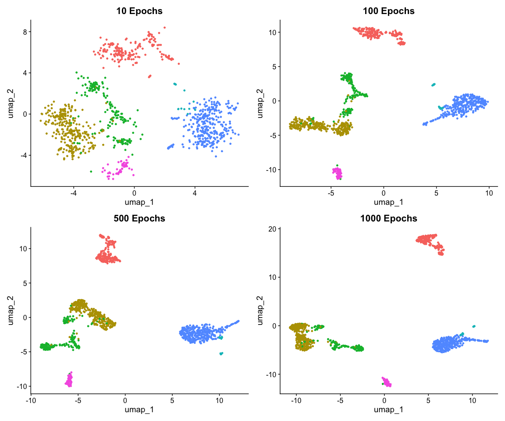<!-- -->

Finally `RunUMAP` allows to set the distance metric for the
high-dimensional space. While in principle this is also possible with
t-SNE, `RunTSNE`, and most other implementations, do not provide this
option. The four possibilities, `Euclidean`, `cosine`, `manhattan`, and
`hamming` distance are shown below. `Cosine` distance is the default
(RunTSNE uses Euclidean distances).

There is not necessarily a clear winner. Hamming distances perform worse
but they are usually used for different data, such as text as they
ignore the numerical difference for a given comparison. Going with the
default cosine is definitely not a bad choice in most applications.

``` r
# Euclidean distance
pbmc <- RunUMAP(pbmc, dims = 1:30, metric = "euclidean", verbose = FALSE)
p1 <- DimPlot(pbmc, reduction = "umap", group.by = "celltype") + NoLegend() + ggtitle("Euclidean")
# Cosine distance
pbmc <- RunUMAP(pbmc, dims = 1:30, metric = "cosine", verbose = FALSE)
p2 <- DimPlot(pbmc, reduction = "umap", group.by = "celltype") + NoLegend() + ggtitle("Cosine")
# Manhattan distance
pbmc <- RunUMAP(pbmc, dims = 1:30, metric = "manhattan", verbose = FALSE)
p3 <- DimPlot(pbmc, reduction = "umap", group.by = "celltype") + NoLegend() + ggtitle("Manhattan")
# Hamming distance
pbmc <- RunUMAP(pbmc, dims = 1:30, metric = "hamming", verbose = FALSE)
p4 <- DimPlot(pbmc, reduction = "umap", group.by = "celltype") + NoLegend() + ggtitle("Hamming")
p1 + p2 + p3 + p4
```

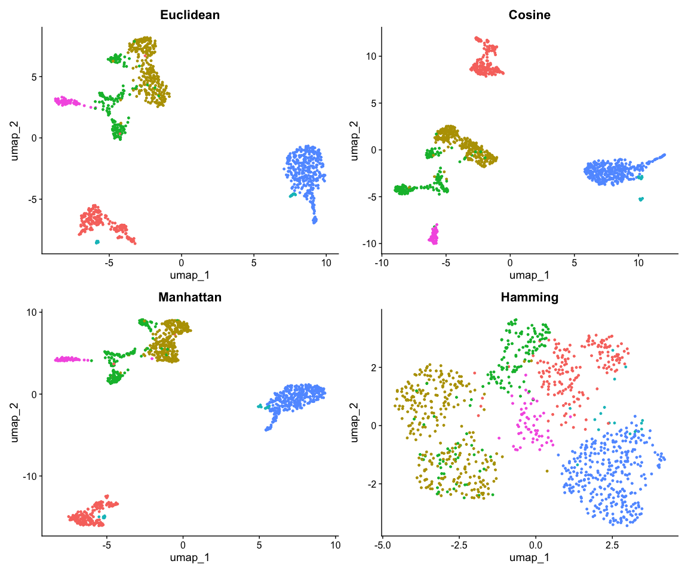<!-- -->

## Visualization

Finally, let’s have a brief look at some visualization options. We have
already use color for grouping. With `label = TRUE` we can add a
text-label to each group and with `repel = TRUE` we can make sure those
labels don’t clump together. Finally, `pt.size = 0.5` changes the size
of the dots used in the plot.

``` r
# Re-run a t-SNE so we do not rely on changes above
pbmc <- RunTSNE(pbmc, dims = 1:30)
DimPlot(pbmc, reduction = "tsne", group.by = "celltype", label = TRUE, repel = TRUE, pt.size = 0.5) + NoLegend()
```

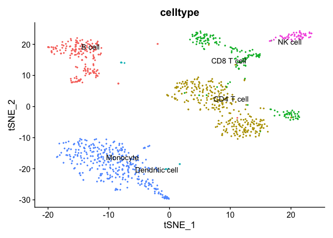<!-- -->

Another property we might want to look at in our dimensionality
reduction plot is the expression of individual genes. We can overlay
gene expression as color using the `FeaturePlot`. Here, we first find
the *top two* features correlated to the *first and second PCs* and
combine them into a single vector which will be the parameter for the
`FeaturePlot`.

Finally, we call `FeaturePlot` with the `pbmc` data object,
`features = topFeaturesPC` uses the extracted feature vector to create
one plot for each feature in the list and lastly, `reduction = "pca"`
will create PCA plots.

Not surprisingly, the top two features of the first PC form a smooth
gradient on the PC_1 axis and the top two features of the second PC a
smooth gradient on the PC_2 axis.

``` r
# find top genes for PCs 1 and 2
topFeaturesPC1 <- TopFeatures(object = pbmc[["pca"]], nfeatures = 2, dim = 1)
topFeaturesPC2 <- TopFeatures(object = pbmc[["pca"]], nfeatures = 2, dim = 2)
# combine the genes into a single vector
topFeaturesPC <- c(topFeaturesPC1, topFeaturesPC2)
print(topFeaturesPC)
```

    ## [1] "LYZ"   "FCN1"  "MS4A1" "CD79A"

``` r
# feature plot with the defined genes
FeaturePlot(pbmc, features = topFeaturesPC, reduction = "pca")
```

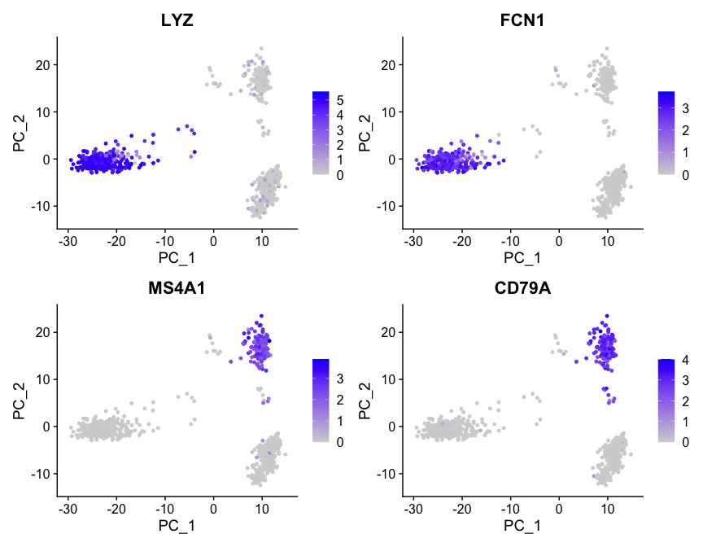<!-- -->

Let’s have a look at the same features on a t-SNE plot. The behavior
here is quite different, with the high expression being very localized
to specific clusters in the maps. Again, not surprising as t-SNE uses
these

``` r
FeaturePlot(pbmc, features = topFeaturesPC, reduction = "tsne")
```

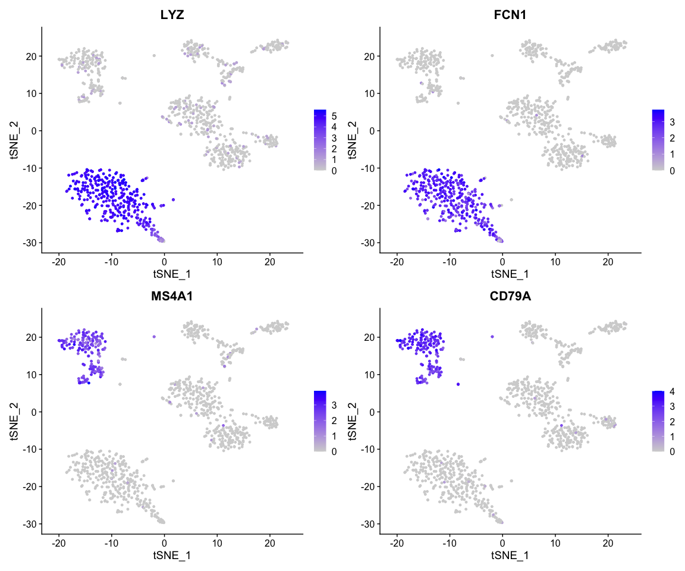<!-- -->

It is clear that the top PCs are fundamental to forming the clusters, so
let’s have a look at more PCs and pick the top gene per PC for a few
more PCs.

``` r
for(i in 1:6) {
  topFeaturesPC[[i]] <- TopFeatures(object = pbmc[["pca"]], nfeatures = 1, dim = i)
}
print(topFeaturesPC)
```

    ## [1] "LYZ"      "CD79A"    "GZMB"     "SERPINF1" "CDKN1C"   "TUBB1"

``` r
FeaturePlot(pbmc, features = topFeaturesPC, reduction = "tsne")
```

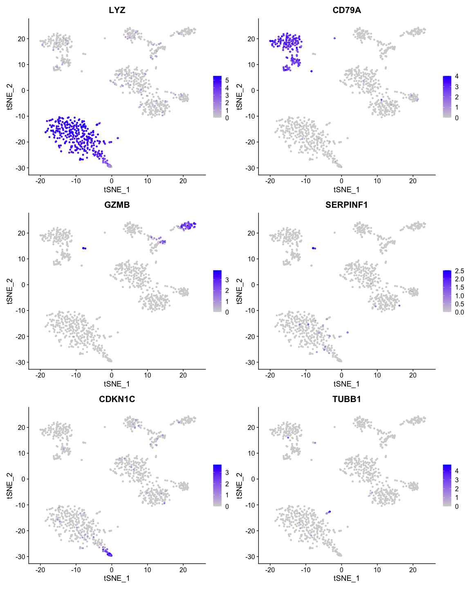<!-- -->

Finally, let’s create a more interactive plot. First we create a regular
`FeaturePlot`, here with just one gene `features = "CD3D"`, a marker of
T cells. Instead of plotting it directly we save the plot in the
`interactivePlot` variable.

With `HoverLocator` we can then embed this plot into an interactive
version. The
`information = FetchData(pbmc, vars = c("celltype", topFeaturesPC))`
creates a set of properties that will be shown on hover over each point.
Im this case, we show the cell-type from the meta information.

The result is a plot that allows us to inspect single cells in detail.

``` r
interactivePlot <- FeaturePlot(pbmc, reduction = "tsne", features = "CD3D")
HoverLocator(plot = interactivePlot, information = FetchData(pbmc, vars = c("celltype", topFeaturesPC)))
```

## Saving the data

Save the Seurat object with the new embeddings for
futurremotes::install_github(‘plotly/plotly.R’)e use downstream.

``` r
saveRDS(pbmc, file = "pbmc3k.rds")
```

If you’re interested in more ways to visualize your data, [this
vignette](https://satijalab.org/seurat/articles/visualization_vignette.html)
might be useful.

## Session info

``` r
sessionInfo()
```

    ## R version 4.4.1 (2024-06-14)
    ## Platform: aarch64-apple-darwin20
    ## Running under: macOS Sonoma 14.5
    ## 
    ## Matrix products: default
    ## BLAS:   /Library/Frameworks/R.framework/Versions/4.4-arm64/Resources/lib/libRblas.0.dylib 
    ## LAPACK: /Library/Frameworks/R.framework/Versions/4.4-arm64/Resources/lib/libRlapack.dylib;  LAPACK version 3.12.0
    ## 
    ## locale:
    ## [1] en_US.UTF-8/en_US.UTF-8/en_US.UTF-8/C/en_US.UTF-8/en_US.UTF-8
    ## 
    ## time zone: Europe/Madrid
    ## tzcode source: internal
    ## 
    ## attached base packages:
    ## [1] stats     graphics  grDevices utils     datasets  methods   base     
    ## 
    ## other attached packages:
    ## [1] ggplot2_3.5.1      Seurat_5.1.0       SeuratObject_5.0.2 sp_2.1-4          
    ## 
    ## loaded via a namespace (and not attached):
    ##   [1] deldir_2.0-4           pbapply_1.7-2          gridExtra_2.3         
    ##   [4] rlang_1.1.4            magrittr_2.0.3         RcppAnnoy_0.0.22      
    ##   [7] spatstat.geom_3.3-2    matrixStats_1.4.1      ggridges_0.5.6        
    ##  [10] compiler_4.4.1         png_0.1-8              vctrs_0.6.5           
    ##  [13] reshape2_1.4.4         stringr_1.5.1          pkgconfig_2.0.3       
    ##  [16] fastmap_1.2.0          labeling_0.4.3         utf8_1.2.4            
    ##  [19] promises_1.3.0         rmarkdown_2.28         purrr_1.0.2           
    ##  [22] xfun_0.47              jsonlite_1.8.8         goftest_1.2-3         
    ##  [25] highr_0.11             later_1.3.2            spatstat.utils_3.1-0  
    ##  [28] irlba_2.3.5.1          parallel_4.4.1         cluster_2.1.6         
    ##  [31] R6_2.5.1               ica_1.0-3              stringi_1.8.4         
    ##  [34] RColorBrewer_1.1-3     spatstat.data_3.1-2    reticulate_1.39.0     
    ##  [37] parallelly_1.38.0      spatstat.univar_3.0-1  lmtest_0.9-40         
    ##  [40] scattermore_1.2        Rcpp_1.0.13            knitr_1.48            
    ##  [43] tensor_1.5             future.apply_1.11.2    zoo_1.8-12            
    ##  [46] FNN_1.1.4              sctransform_0.4.1      httpuv_1.6.15         
    ##  [49] Matrix_1.7-0           splines_4.4.1          igraph_2.0.3          
    ##  [52] tidyselect_1.2.1       abind_1.4-8            yaml_2.3.10           
    ##  [55] spatstat.random_3.3-1  codetools_0.2-20       miniUI_0.1.1.1        
    ##  [58] spatstat.explore_3.3-2 listenv_0.9.1          lattice_0.22-6        
    ##  [61] tibble_3.2.1           plyr_1.8.9             withr_3.0.1           
    ##  [64] shiny_1.9.1            ROCR_1.0-11            evaluate_0.24.0       
    ##  [67] Rtsne_0.17             future_1.34.0          fastDummies_1.7.4     
    ##  [70] survival_3.7-0         polyclip_1.10-7        fitdistrplus_1.2-1    
    ##  [73] pillar_1.9.0           KernSmooth_2.23-24     plotly_4.10.4         
    ##  [76] generics_0.1.3         RcppHNSW_0.6.0         munsell_0.5.1         
    ##  [79] scales_1.3.0           globals_0.16.3         xtable_1.8-4          
    ##  [82] glue_1.7.0             lazyeval_0.2.2         tools_4.4.1           
    ##  [85] data.table_1.16.0      RSpectra_0.16-2        RANN_2.6.2            
    ##  [88] leiden_0.4.3.1         dotCall64_1.1-1        cowplot_1.1.3         
    ##  [91] grid_4.4.1             tidyr_1.3.1            colorspace_2.1-1      
    ##  [94] nlme_3.1-166           patchwork_1.2.0        cli_3.6.3             
    ##  [97] spatstat.sparse_3.1-0  spam_2.10-0            fansi_1.0.6           
    ## [100] viridisLite_0.4.2      dplyr_1.1.4            uwot_0.2.2            
    ## [103] gtable_0.3.5           digest_0.6.37          progressr_0.14.0      
    ## [106] ggrepel_0.9.6          farver_2.1.2           htmlwidgets_1.6.4     
    ## [109] htmltools_0.5.8.1      lifecycle_1.0.4        httr_1.4.7            
    ## [112] mime_0.12              MASS_7.3-61
