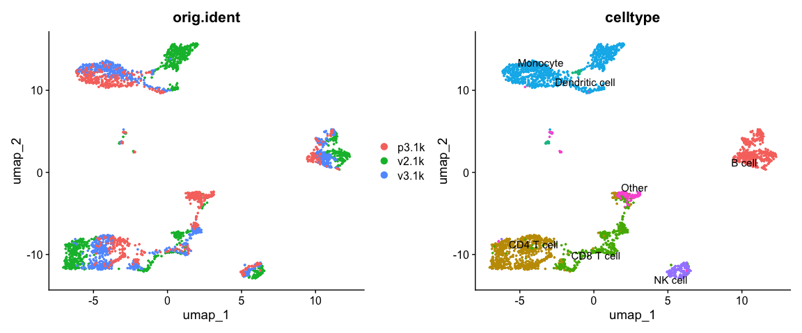
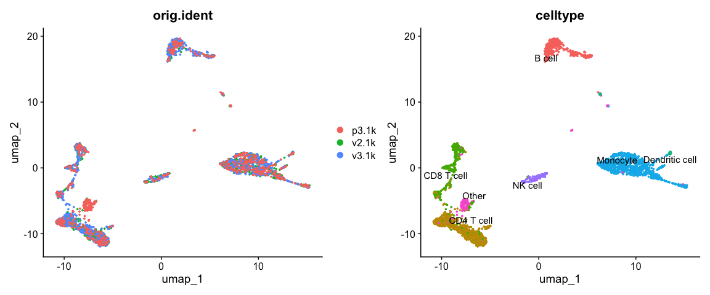
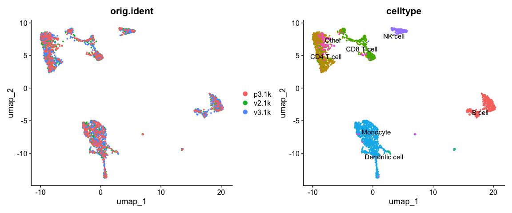
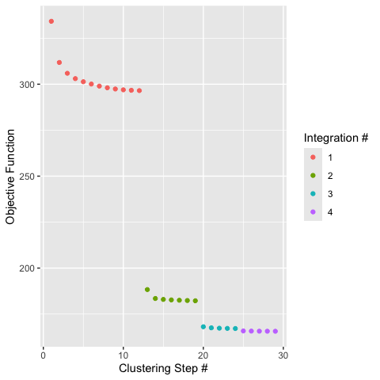
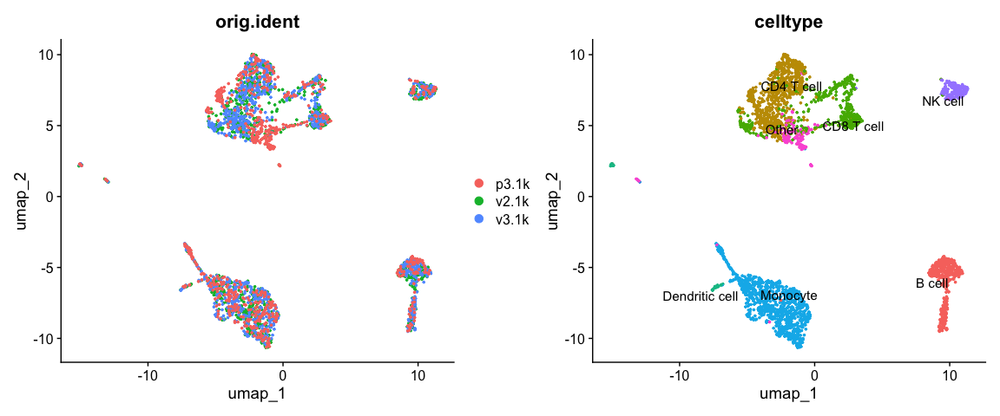

Data Integration
================

Created by: Ahmed Mahfouz

Edited by: Mohammed Charrout, Lieke Michielsen, Claudio Novella-Rausell

# Overview

In this tutorial we will look at different ways of integrating multiple
single cell RNA-seq datasets. We will explore two different methods to
correct for batch effects across datasets. At the end of the session, we
will also show how to transfer cell type labels from a reference dataset
to a new dataset.

## Datasets

For this tutorial, we will use the 3 different PBMC datasets we also
started the normalization practical with.

Load required packages:

``` r
# Clear the workspace
rm(list=ls())

suppressMessages(require(Seurat))
suppressMessages(require(SeuratDisk))
suppressMessages(require(harmony))
## Please use devtools::install_github("eddelbuettel/harmony",force = TRUE) to install harmony if it showed error on "Runharmony" function on your own device.
```

## Seurat (anchors and CCA)

First we will use the data integration method presented in
[Comprehensive Integration of Single Cell
Data](https://www.sciencedirect.com/science/article/pii/S0092867419305598?via%3Dihub).

### Data preprocessing

First, we load the three datasets and some celltype labels.

``` r
pbmc_v3.1k <- readRDS('../session-clustering/pbmc3k.rds')
pbmc_v3.1k$orig.ident <- "v3.1k"
v2.1k <- Read10X_h5("../session-qc-normalization/pbmc_1k_v2_filtered_feature_bc_matrix.h5")
p3.1k <- Read10X_h5("../session-qc-normalization/pbmc_1k_protein_v3_filtered_feature_bc_matrix.h5")
```

    ## Genome matrix has multiple modalities, returning a list of matrices for this genome

``` r
p3.1k <- p3.1k$`Gene Expression`

pbmc_v2.1k <- CreateSeuratObject(v2.1k, project = "v2.1k")
pbmc_p3.1k <- CreateSeuratObject(p3.1k, project = "p3.1k")

labels_v2.1k = read.delim('celltypes_1k_v2.tsv', row.names = 1)
labels_p3.1k = read.delim('celltypes_1k_protein.tsv', row.names = 1)

pbmc_v2.1k <- AddMetaData(
    object = pbmc_v2.1k,
    metadata = labels_v2.1k)

pbmc_p3.1k <- AddMetaData(
    object = pbmc_p3.1k,
    metadata = labels_p3.1k)
```

Create a Seurat object with all datasets.

``` r
pbmc <- merge(pbmc_v2.1k, c(pbmc_v3.1k, pbmc_p3.1k), add.cell.ids=c("v2.1k","v3.1k","p3.1k"))
```

Let’s first look at the datasets before applying any batch correction.
We perform standard preprocessing (log-normalization), and identify
variable features based on a variance stabilizing transformation
(`"vst"`). Next, we scale the integrated data, run PCA, and visualize
the results with UMAP. As you can see, the different batches do not
overlap in the UMAP.

``` r
# Normalize and find variable features
pbmc <- NormalizeData(pbmc, verbose = FALSE)
pbmc <- FindVariableFeatures(pbmc, selection.method = "vst", nfeatures = 2000, verbose = FALSE)
    
# Run the standard workflow for visualization and clustering
pbmc <- ScaleData(pbmc, verbose = FALSE)
pbmc <- RunPCA(pbmc, npcs = 30, verbose = FALSE)
pbmc <- RunUMAP(pbmc, reduction = "pca", dims = 1:30, verbose = FALSE)
```

    ## Warning: The default method for RunUMAP has changed from calling Python UMAP via reticulate to the R-native UWOT using the cosine metric
    ## To use Python UMAP via reticulate, set umap.method to 'umap-learn' and metric to 'correlation'
    ## This message will be shown once per session

``` r
p1 <- DimPlot(pbmc, reduction = "umap", group.by = "orig.ident")
p2 <- DimPlot(pbmc, reduction = "umap", group.by = "celltype", label = TRUE, repel = TRUE) + 
    NoLegend()
p1 + p2
```

<!-- -->

We split the combined object into a list, with each dataset as an
element. We perform standard preprocessing (log-normalization), and
identify variable features individually for each dataset based on a
variance stabilizing transformation (`"vst"`).

``` r
pbmc.list <- SplitObject(pbmc, split.by = "orig.ident")

for (i in 1:length(pbmc.list)) {
    pbmc.list[[i]] <- NormalizeData(pbmc.list[[i]], verbose = FALSE)
    pbmc.list[[i]] <- FindVariableFeatures(pbmc.list[[i]], selection.method = "vst", nfeatures = 2000, 
        verbose = FALSE)
}

### Select features that are repeatedly variable genes across the different dataset

features <- SelectIntegrationFeatures(pbmc.list)
```

### Integration of three PBMC datasets

We identify anchors using the `FindIntegrationAnchors` function, which
takes a list of Seurat objects as input.

``` r
pbmc.anchors <- FindIntegrationAnchors(pbmc.list, dims = 1:30)
```

    ## Computing 2000 integration features

    ## Scaling features for provided objects

    ## Finding all pairwise anchors

    ## Running CCA

    ## Merging objects

    ## Finding neighborhoods

    ## Finding anchors

    ##  Found 3288 anchors

    ## Filtering anchors

    ##  Retained 3038 anchors

    ## Finding neighborhoods

    ## Finding anchors

    ##  Found 2999 anchors

    ## Filtering anchors

    ##  Retained 2680 anchors

    ## Finding neighborhoods

    ## Finding anchors

    ##  Found 2999 anchors

    ## Filtering anchors

    ##  Retained 2680 anchors

    ## Running CCA

    ## Merging objects

    ## Finding neighborhoods

    ## Finding anchors

    ##  Found 3360 anchors

    ## Filtering anchors

    ##  Retained 3065 anchors

    ## Finding neighborhoods

    ## Finding anchors

    ##  Found 2556 anchors

    ## Filtering anchors

    ##  Retained 2159 anchors

    ## Finding neighborhoods

    ## Finding anchors

    ##  Found 2556 anchors

    ## Filtering anchors

    ##  Retained 2159 anchors

    ## Running CCA

    ## Merging objects

    ## Finding neighborhoods

    ## Finding anchors

    ##  Found 3546 anchors

    ## Filtering anchors

    ##  Retained 3291 anchors

    ## Finding neighborhoods

    ## Finding anchors

    ##  Found 2538 anchors

    ## Filtering anchors

    ##  Retained 2169 anchors

    ## Finding neighborhoods

    ## Finding anchors

    ##  Found 2538 anchors

    ## Filtering anchors

    ##  Retained 2169 anchors

We then pass these anchors to the `IntegrateData` function, which
returns a Seurat object.

``` r
pbmc.integrated <- IntegrateData(pbmc.anchors)
```

    ## Merging dataset 3 into 2

    ## Extracting anchors for merged samples

    ## Finding integration vectors

    ## Warning: Different features in new layer data than already exists for
    ## scale.data

    ## Finding integration vector weights

    ## Integrating data

    ## Warning: Layer counts isn't present in the assay object; returning NULL

    ## Merging dataset 1 into 2 3

    ## Extracting anchors for merged samples

    ## Finding integration vectors

    ## Warning: Different cells in new layer data than already exists for scale.data

    ## Finding integration vector weights

    ## Integrating data

    ## Warning: Layer counts isn't present in the assay object; returning NULL

After running `IntegrateData`, the `Seurat` object will contain a new
`Assay` with the integrated (or ‘batch-corrected’) expression matrix.
Note that the original (uncorrected values) are still stored in the
object in the “RNA” assay, so you can switch back and forth.

We can then use this new integrated matrix for downstream analysis and
visualization. Here we scale the integrated data, run PCA, and visualize
the results with UMAP. The integrated datasets cluster by cell type,
instead of by technology.

``` r
# switch to integrated assay. The variable features of this assay are automatically set during
# IntegrateData
DefaultAssay(pbmc.integrated) <- "integrated"

# Run the standard workflow for visualization and clustering
pbmc.integrated <- ScaleData(pbmc.integrated, verbose = FALSE)
pbmc.integrated <- RunPCA(pbmc.integrated, npcs = 30, verbose = FALSE)
pbmc.integrated <- RunUMAP(pbmc.integrated, reduction = "pca", dims = 1:30, verbose = FALSE)
p1 <- DimPlot(pbmc.integrated, reduction = "umap", group.by = "orig.ident")
p2 <- DimPlot(pbmc.integrated, reduction = "umap", group.by = "celltype", label = TRUE, repel = TRUE) + 
    NoLegend()
p1+p2
```

<!-- -->

### Seurat v5 (CCA) stream-lined integration

In Seurat version 5, the authors introduced a streamlined one-liner for
integrating single-cell data. This command directly outputs a corrected
dimensionality reduction, enabling immediate visualization.

``` r
pbmc <- IntegrateLayers(object = pbmc, method = CCAIntegration, orig.reduction = "pca", new.reduction = "integrated.cca.pca")
```

    ## Finding all pairwise anchors

    ## Running CCA

    ## Merging objects

    ## Finding neighborhoods

    ## Finding anchors

    ##  Found 2635 anchors

    ## Running CCA

    ## Merging objects

    ## Finding neighborhoods

    ## Finding anchors

    ##  Found 2320 anchors

    ## Running CCA

    ## Merging objects

    ## Finding neighborhoods

    ## Finding anchors

    ##  Found 2269 anchors

    ## Merging dataset 3 into 1

    ## Extracting anchors for merged samples

    ## Finding integration vectors

    ## Finding integration vector weights

    ## Integrating data

    ## Merging dataset 2 into 1 3

    ## Extracting anchors for merged samples

    ## Finding integration vectors

    ## Finding integration vector weights

    ## Integrating data

``` r
# re-join layers after integration
pbmc[["RNA"]] <- JoinLayers(pbmc[["RNA"]])
pbmc <- RunUMAP(pbmc, dims = 1:30, reduction = "integrated.cca.pca")
```

    ## 14:16:41 UMAP embedding parameters a = 0.9922 b = 1.112

    ## 14:16:41 Read 2763 rows and found 30 numeric columns

    ## 14:16:41 Using Annoy for neighbor search, n_neighbors = 30

    ## 14:16:41 Building Annoy index with metric = cosine, n_trees = 50

    ## 0%   10   20   30   40   50   60   70   80   90   100%

    ## [----|----|----|----|----|----|----|----|----|----|

    ## **************************************************|
    ## 14:16:41 Writing NN index file to temp file /var/folders/kq/_ntfn5zx1b199xp4vyd82t840000gn/T//RtmpwT7pa1/file136a3bd1a5ff
    ## 14:16:41 Searching Annoy index using 1 thread, search_k = 3000
    ## 14:16:42 Annoy recall = 100%
    ## 14:16:42 Commencing smooth kNN distance calibration using 1 thread with target n_neighbors = 30
    ## 14:16:42 Initializing from normalized Laplacian + noise (using RSpectra)
    ## 14:16:42 Commencing optimization for 500 epochs, with 119012 positive edges
    ## 14:16:44 Optimization finished

``` r
# Visualization
p1 <- DimPlot(pbmc, reduction = "umap", group.by = "orig.ident")
p2 <- DimPlot(pbmc, reduction = "umap", group.by = "celltype", label = TRUE, repel = TRUE) + 
    NoLegend()
p1+p2
```

<!-- -->

## Harmony

An alternative approach to integrate single cell RNA-seq data is using
[Harmony](https://doi.org/10.1038/s41592-019-0619-0). The simplest way
to run Harmony, is to directly run it on a Seurat object.

``` r
pbmc <- RunPCA(pbmc, npcs = 30, verbose = FALSE)
pbmc <- RunHarmony(pbmc, "orig.ident", plot_convergence = TRUE)
```

    ## Transposing data matrix

    ## Initializing state using k-means centroids initialization

    ## Harmony 1/10

    ## Harmony 2/10

    ## Harmony 3/10

    ## Harmony 4/10

    ## Harmony converged after 4 iterations

<!-- -->

Let’s visualize these results. We will again plot a UMAP, but instead of
running UMAP on the PCA embedding, we will run it on the embedding
returned by Harmony.

``` r
pbmc <- RunUMAP(pbmc, reduction = "harmony", dims = 1:20, verbose = FALSE)
p1 <- DimPlot(pbmc, reduction = "umap", group.by = "orig.ident")
p2 <- DimPlot(pbmc, reduction = "umap", group.by = "celltype", label = TRUE, repel = TRUE) + 
    NoLegend()
p1+p2
```

<!-- -->

# Projecting labels from a reference atlas

For some well studied tissues, there exists already a reference atlas.
Cell type labels from this reference atlas can then be easily propagated
to your own new dataset. As discussed in the lecture, clustering can be
quite subjective and time-consuming. With these automatic approaches,
you can overcome these issues.

An example of an automatic method is Azimuth. When using Azimuth for
small datasets, it is easiest to use the
[webportal](https://azimuth.hubmapconsortium.org/). Here, you can choose
which reference atlas you want to use, upload your own dataset, choose
the normalization procedure, and transfer the labels. You can try this
yourself with the three PBMC datasets. The best way to annotate them, is
to upload the raw counts separately to the portal.

For larger datasets it is easier to download the reference atlas itself
and annotate them. The code below shows how to do it. This code will
take a long time or is impossible to run on a normal desktop or Rstudio
cloud, but is very convenient for an HPC cluster.

First we
[download](https://atlas.fredhutch.org/data/nygc/multimodal/pbmc_multimodal.h5seurat)
the reference dataset.

Next, we load the reference and align one of the pbmc datasets.

``` r
reference <- LoadH5Seurat("pbmc_multimodal.h5seurat")

pbmc_v3.1k <- SCTransform(pbmc_v3.1k, verbose=FALSE)

anchors <- FindTransferAnchors(reference=reference,
                               query = pbmc_v3.1k, 
                               normalization.method='SCT',
                               reference.reduction='spca',
                               dims=1:50
                               )

pbmc_v3.1k <- MapQuery(
  anchorset = anchors,
  query = pbmc_v3.1k,
  reference = reference,
  refdata = list(
    celltype.l1 = "celltype.l1",
    celltype.l2 = "celltype.l2",
    predicted_ADT = "ADT"
  ),
  reference.reduction = "spca", 
  reduction.model = "wnn.umap"
)

p1 = DimPlot(pbmc_v3.1k, reduction = "ref.umap", group.by = "predicted.celltype.l1", label = TRUE, label.size = 3, repel = TRUE) + NoLegend()
p2 = DimPlot(pbmc_v3.1k, reduction = "ref.umap", group.by = "predicted.celltype.l2", label = TRUE, label.size = 3 ,repel = TRUE) + NoLegend()
p1 + p2
```

### Session info

``` r
sessionInfo()
```

    ## R version 4.4.1 (2024-06-14)
    ## Platform: aarch64-apple-darwin20
    ## Running under: macOS Sonoma 14.5
    ## 
    ## Matrix products: default
    ## BLAS:   /Library/Frameworks/R.framework/Versions/4.4-arm64/Resources/lib/libRblas.0.dylib 
    ## LAPACK: /Library/Frameworks/R.framework/Versions/4.4-arm64/Resources/lib/libRlapack.dylib;  LAPACK version 3.12.0
    ## 
    ## locale:
    ## [1] en_US.UTF-8/en_US.UTF-8/en_US.UTF-8/C/en_US.UTF-8/en_US.UTF-8
    ## 
    ## time zone: Europe/Madrid
    ## tzcode source: internal
    ## 
    ## attached base packages:
    ## [1] stats     graphics  grDevices utils     datasets  methods   base     
    ## 
    ## other attached packages:
    ## [1] harmony_1.2.1         Rcpp_1.0.13           SeuratDisk_0.0.0.9021
    ## [4] Seurat_5.1.0          SeuratObject_5.0.2    sp_2.1-4             
    ## 
    ## loaded via a namespace (and not attached):
    ##   [1] deldir_2.0-4           pbapply_1.7-2          gridExtra_2.3         
    ##   [4] rlang_1.1.4            magrittr_2.0.3         RcppAnnoy_0.0.22      
    ##   [7] spatstat.geom_3.3-2    matrixStats_1.4.1      ggridges_0.5.6        
    ##  [10] compiler_4.4.1         png_0.1-8              vctrs_0.6.5           
    ##  [13] reshape2_1.4.4         hdf5r_1.3.11           stringr_1.5.1         
    ##  [16] crayon_1.5.3           pkgconfig_2.0.3        fastmap_1.2.0         
    ##  [19] labeling_0.4.3         utf8_1.2.4             promises_1.3.0        
    ##  [22] rmarkdown_2.28         bit_4.0.5              purrr_1.0.2           
    ##  [25] xfun_0.47              jsonlite_1.8.8         goftest_1.2-3         
    ##  [28] highr_0.11             later_1.3.2            spatstat.utils_3.1-0  
    ##  [31] irlba_2.3.5.1          parallel_4.4.1         cluster_2.1.6         
    ##  [34] R6_2.5.1               ica_1.0-3              stringi_1.8.4         
    ##  [37] RColorBrewer_1.1-3     spatstat.data_3.1-2    reticulate_1.39.0     
    ##  [40] parallelly_1.38.0      spatstat.univar_3.0-1  lmtest_0.9-40         
    ##  [43] scattermore_1.2        knitr_1.48             tensor_1.5            
    ##  [46] future.apply_1.11.2    zoo_1.8-12             sctransform_0.4.1     
    ##  [49] httpuv_1.6.15          Matrix_1.7-0           splines_4.4.1         
    ##  [52] igraph_2.0.3           tidyselect_1.2.1       abind_1.4-8           
    ##  [55] yaml_2.3.10            spatstat.random_3.3-1  codetools_0.2-20      
    ##  [58] miniUI_0.1.1.1         spatstat.explore_3.3-2 listenv_0.9.1         
    ##  [61] lattice_0.22-6         tibble_3.2.1           plyr_1.8.9            
    ##  [64] withr_3.0.1            shiny_1.9.1            ROCR_1.0-11           
    ##  [67] evaluate_0.24.0        Rtsne_0.17             future_1.34.0         
    ##  [70] fastDummies_1.7.4      survival_3.7-0         polyclip_1.10-7       
    ##  [73] fitdistrplus_1.2-1     pillar_1.9.0           KernSmooth_2.23-24    
    ##  [76] plotly_4.10.4          generics_0.1.3         RcppHNSW_0.6.0        
    ##  [79] ggplot2_3.5.1          munsell_0.5.1          scales_1.3.0          
    ##  [82] globals_0.16.3         xtable_1.8-4           RhpcBLASctl_0.23-42   
    ##  [85] glue_1.7.0             lazyeval_0.2.2         tools_4.4.1           
    ##  [88] data.table_1.16.0      RSpectra_0.16-2        RANN_2.6.2            
    ##  [91] leiden_0.4.3.1         dotCall64_1.1-1        cowplot_1.1.3         
    ##  [94] grid_4.4.1             tidyr_1.3.1            colorspace_2.1-1      
    ##  [97] nlme_3.1-166           patchwork_1.2.0        cli_3.6.3             
    ## [100] spatstat.sparse_3.1-0  spam_2.10-0            fansi_1.0.6           
    ## [103] viridisLite_0.4.2      dplyr_1.1.4            uwot_0.2.2            
    ## [106] gtable_0.3.5           digest_0.6.37          progressr_0.14.0      
    ## [109] ggrepel_0.9.6          farver_2.1.2           htmlwidgets_1.6.4     
    ## [112] htmltools_0.5.8.1      lifecycle_1.0.4        httr_1.4.7            
    ## [115] mime_0.12              bit64_4.0.5            MASS_7.3-61
